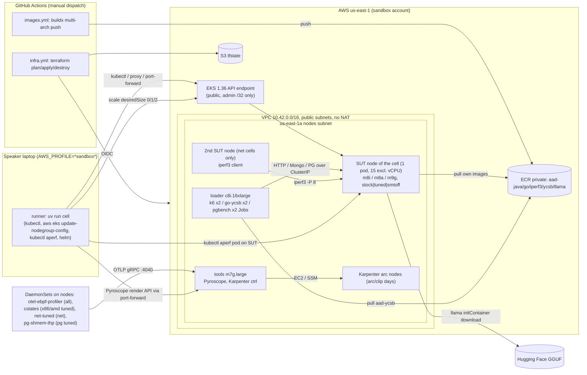

# Facts: setup and architecture (internal working material)

Compiled 2026-09-28, read-only from the repo. Every fact carries its source as
`path:line` (repo-relative) or a results file. Where two files disagree, both are
cited and the item is repeated under "Open questions". No account IDs, ARNs,
admin CIDRs or credentials are reproduced here (`results/*/cluster.json`,
`ecr.json`, `infra/terraform.tfvars` and `results/*/inventory-raw` carry them).

---

## 1. Hardware under test

### 1.1 The three SUT instance types

| | Intel `m8i.4xlarge` | AMD `m8a.4xlarge` | Graviton5 `m9g.4xlarge` |
|---|---|---|---|
| vCPU | 16 = 8 cores x 2 threads (SMT on) | 16 = 16 cores, 1 thread/core (no SMT) | 16 = 16 cores, 1 thread/core |
| Source | docs/superpowers/specs/2026-09-02-armed-and-dangerous-design.md:63, infra/nodegroups.tf:71-72 | spec:66, spec:73, infra/nodegroups.tf:87-90, runner/config.py:117-118 | spec:68, spec:176 |
| Memory | 64 GiB (spec:63) | 64 GiB (spec:66, infra/README.md:64) | 64 GiB (spec:68, spec:176) |
| CPU | Intel Xeon 6 "Granite Rapids", sustained all-core turbo 3.9 GHz (spec:63, spec:177) | AMD EPYC 9R45 "Turin", 4.5 GHz sustained (spec:73, infra/README.md:63-64) | AWS Graviton5, Neoverse V3, 3.3 GHz (spec:176) |
| DRAM | DDR5-7200 (spec:63, spec:177) | not recorded in repo | DDR5-8800 (spec:176) |
| Network cap | "up to 15 Gbps" (spec:177, spec:181) | "Up to 15 Gigabit" (spec:73) | "up to 17 Gbps" (spec:181); 16.86 / 16.89 Gbps measured at the gate (results/profiler-gate.md:87) |
| EBS bandwidth | 10,000 Mbps (spec:181, listed as "EBS 10,000 vs 12,000 Mbps" in m8i-vs-m9g order) | not recorded in repo | 12,000 Mbps (spec:181, same line) |
| On-demand us-east-1 | $0.84672/h (results/cost.md:30) | $0.97376/h (results/cost.md:31) | $0.78272/h (results/cost.md:32) |
| C-state control by OS | yes, "C-states only" list (manifests/base/cstates-daemonset.yaml:50, spec:86) | yes, same list (cstates-daemonset.yaml:51-53) | no: "operate at a fixed frequency ... do not provide the ability ... to control C-states and P-states" (cstates-daemonset.yaml:46-49) |
| SMT can be turned off | yes (spec:87) | nothing to turn off (infra/nodegroups.tf:90) | no, Graviton cannot change threads/core (infra/nodegroups.tf:73) |

Read on real nodes at the smoke gate 2026-09-04 (results/profiler-gate.md:7-20):
- m8i: `thread_siblings_list` of cpu0 = `0,8` (SMT active); cpuidle driver `intel_idle`, states POLL 0 / C1 1 / C1E 4 / C6 170 / C6P 210 us.
- m8i with `threads_per_core=1`: 8 visible CPUs, siblings `0`.
- m9g: siblings `0`; cpuidle driver `none`, no idle state exposed.
- No `irqbalance` on any host; `ethtool` present; 18 ENA IRQs in `/proc/interrupts`.
- kubelet `cpuManagerPolicy` = `static`; allocatable CPU 15750m (16 vCPU nodes) / 7750m (smtoff).

### 1.2 Node groups (infra/nodegroups.tf)

One EKS managed node group per "cell" (one silicon in one configuration), scaled 0 -> 1 (2 for net) by the runner and back to 0 (infra/nodegroups.tf:1-4). All SUT groups: `min 0 / desired 0 / max 2`, taint `aad/sut=true:NO_SCHEDULE` (infra/nodegroups.tf:18-35).

| Node group (name) | Instance | AMI type | User data | Label | Notes |
|---|---|---|---|---|---|
| `aws-aad-mng-x86-stock` | m8i.4xlarge | BOTTLEROCKET_x86_64 | base.toml | `aad/cell=x86-stock` | infra/nodegroups.tf:53-59 |
| `aws-aad-mng-x86-tuned` | m8i.4xlarge | BOTTLEROCKET_x86_64 | base.toml + thp.toml | `aad/cell=x86-tuned` | infra/nodegroups.tf:62-68 |
| `aws-aad-mng-x86-smtoff` | m8i.4xlarge, `cpu_options {core_count=8, threads_per_core=1}` | BOTTLEROCKET_x86_64 | base.toml + thp.toml | `aad/cell=x86-smtoff` | max 1, not a net cell (infra/nodegroups.tf:74-85) |
| `aws-aad-mng-amd-stock` | m8a.4xlarge | BOTTLEROCKET_x86_64 | base.toml | `aad/cell=amd-stock` | added 2026-09-25 (infra/nodegroups.tf:87-97) |
| `aws-aad-mng-amd-tuned` | m8a.4xlarge | BOTTLEROCKET_x86_64 | base.toml + thp.toml | `aad/cell=amd-tuned` | infra/nodegroups.tf:99-105 |
| `aws-aad-mng-arm-stock` | m9g.4xlarge | BOTTLEROCKET_ARM_64 | base.toml | `aad/cell=arm-stock` | infra/nodegroups.tf:107-113 |
| `aws-aad-mng-arm-tuned` | m9g.4xlarge | BOTTLEROCKET_ARM_64 | base.toml + thp.toml | `aad/cell=arm-tuned` | infra/nodegroups.tf:117-123 |
| `aws-aad-mng-loader` | c8i.16xlarge (64 vCPU) | BOTTLEROCKET_x86_64 | none | `aad/role=loader` | untainted; min 0 / max 1 / desired 1 (infra/nodegroups.tf:40-45, 129-134) |
| `aws-aad-mng-tools` | m7g.large (2 vCPU / 8 GiB) | BOTTLEROCKET_ARM_64 | none | `aad/role=tools` | Pyroscope + Karpenter controller (infra/nodegroups.tf:136-142; manifests/base/karpenter-values.yaml:48) |

Workload cells that are NOT node groups (runner/config.py:93-111): `x86-t8` and the three `*-tuned-vthreads` run on the matching tuned group; `arm-tuned-kleidiai` runs on `arm-tuned`.

### 1.3 OS: Bottlerocket

- AMI type BOTTLEROCKET_x86_64 / BOTTLEROCKET_ARM_64, variant `aws-k8s-1.36` (infra/README.md:27-28).
- AMI release = SSM `/aws/service/bottlerocket/aws-k8s-1.36/<arch>/latest/image_version` at apply time, pinned into state (`use_latest_ami_release_version = false`) (infra/main.tf:74-78, infra/nodegroups.tf:158-166). So the version is whatever was latest on each apply day.
- Plan fails if Bottlerocket < 1.64.0 (THP setting) (infra/main.tf:70-106).
- Observed: 2026-09-04 Bottlerocket 1.64.0, kernel 6.18.38 (results/profiler-gate.md:3); 2026-09-24/25 Bottlerocket OS 1.66.0 (aws-k8s-1.36), kernel 6.18.48, kubelet v1.36.2-eks-bca9cf6, containerd 2.2.8+bottlerocket, AMIs `bottlerocket-aws-k8s-1.36-{x86_64,aarch64}-v1.66.0-1ad6b4a4` (results/2026-09-24/inventory/nodes-all.json:224-232, 508-516; results/2026-09-24/inventory/amis.json).
- arm64 kernel uses 4 KiB pages (`CONFIG_ARM64_4K_PAGES=y`) (manifests/base/pg-shmem-thp-daemonset.yaml:26-28).

### 1.4 Kubelet / CPU manager (control, on all seven SUT groups, stock included)

- `settings.kubernetes.cpu-manager-policy = "static"` (infra/userdata/base.toml:52-53).
- `settings.kubernetes.kube-reserved.cpu = "250m"` -> kubelet ceils to one whole reserved vCPU (cpu0 = shared pool for DaemonSets; cpu1-15 exclusive); allocatable 15750m (7750m on smtoff) (infra/userdata/base.toml:59-81).
- `cpu-manager-policy-options` (full-pcpus-only) deliberately not set, because 15 is not a whole number of SMT pairs (infra/userdata/base.toml:55-57).
- Every SUT pod is Guaranteed QoS with integer CPU: 15 exclusive vCPUs (7 on x86-smtoff) (runner/config.py:125-129; manifests/base/README.md:175-176). The runner verifies `cpuset.cpus.effective` (Go: `runtime.NumCPU()` via `/healthz`) equals that count or aborts the cell (runner/cell.py:477-518). Example: `cpuset "1-15"`, count 15 (results/2026-09-25-task7-d1/java/amd-tuned/run-1/meta.json).
- Caveat recorded: on SMT x86 the reserved cpu0 shares a physical core with one of the pod's 15 threads (manifests/base/README.md:330-332).

### 1.5 What "stock" and "tuned" mean at the node level

| Knob | x86 (m8i) | AMD (m8a) | Graviton (m9g) | Mechanism / source |
|---|---|---|---|---|
| Static CPU manager + 1 reserved vCPU | stock and tuned | stock and tuned | stock and tuned | control, infra/userdata/base.toml:1-6 |
| THP `enabled=always` | tuned, smtoff | tuned | tuned | Bottlerocket `settings.kernel.hugepages.transparent.enabled`, first-boot user data, no reboot (infra/userdata/thp.toml:18-19); verified `[always]` on tuned nodes (results/profiler-gate.md:9) |
| THP `defrag` | OS default | OS default | OS default | left unset -> `madvise` (infra/userdata/thp.toml:20-26; results/profiler-gate.md:10) |
| C-states capped at C1 | tuned, smtoff | tuned | n/a (no knob exists) | DaemonSet `cstates` holds `/dev/cpu_dma_latency` open at C1's exit latency (not 0) (manifests/base/cstates-daemonset.yaml:1-40, 84-91); read 1 us on m8i (results/profiler-gate.md:15); runner requires it Ready on the SUT for x86-tuned/x86-smtoff/amd-tuned (runner/cell.py:448-474) |
| SMT off | smtoff only | none | none | EC2 `cpu_options.threads_per_core=1` (infra/nodegroups.tf:70-85) |
| ENA IRQ pin (round-robin 1 IRQ per vCPU), `adaptive-rx off`, RPS check | tuned, net workload only | tuned, net only | tuned, net only | DaemonSet `net-tuned`, applied/deleted by the runner around net cells (manifests/base/net-tuned-daemonset.yaml:1-36, 64-74; runner/cell.py:1974-1979, 2136-2138). No irqbalance to disable on Bottlerocket (net-tuned-daemonset.yaml:14-19) |
| shmem THP (`shmem_enabled=always`) | tuned, postgres only | tuned, postgres only | tuned, postgres only | DaemonSet `pg-shmem-thp`, ON by default for postgres tuned cells since 2026-09-26 (runner/cell.py:2450-2462; manifests/base/pg-shmem-thp-daemonset.yaml:84-94) |

The cstates DaemonSet is part of `manifests/base` (manifests/base/kustomization.yaml:6-10), so it is on every x86-tuned/x86-smtoff/amd-tuned node for every workload. The net and pg-shmem DaemonSets are deliberately not in base (manifests/base/kustomization.yaml:12-20).

---

## 2. Cluster architecture

### 2.1 Core

- EKS `kubernetes_version = "1.36"` (infra/variables.tf:44-48); platform `eks.14` observed 2026-09-24 (results/2026-09-24/inventory/cluster.json).
- Region us-east-1 (infra/variables.tf:1-5; runner/config.py:23).
- Cluster name `aws-aad-eks-lab`, hard-validated because the Karpenter discovery tag is literal in the NodeClass YAML (infra/variables.tf:7-16).
- Add-ons: coredns, kube-proxy, vpc-cni (before compute), eks-pod-identity-agent (before compute), aws-ebs-csi-driver (Pod Identity role, `extraVolumeTags`), metrics-server (infra/main.tf:258-289). Versions not pinned in Terraform; observed 2026-09-24: ebs-csi v1.66.0-eksbuild.1, vpc-cni v1.23.1-eksbuild.1, kube-proxy v1.36.0-eksbuild.25, pod-identity-agent v1.4.0-eksbuild.2, coredns v1.14.6-eksbuild.4, metrics-server v0.9.0-eksbuild.11 (results/2026-09-24/inventory/addons/*.json).
- Default StorageClass `gp3` (ebs.csi.aws.com, WaitForFirstConsumer); EKS's gp2 default is flipped off by hand (manifests/base/storageclass-default.yaml:17-27; manifests/base/README.md:13-15).
- Namespace `aad`, Pod Security `privileged` (enforce/audit/warn) because the knob/profiler DaemonSets are privileged (manifests/base/namespace.yaml:1-15).

### 2.2 Network

- Own VPC `aws-aad-vpc`, CIDR 10.42.0.0/16, created and destroyed each lab day; two public subnets, no NAT gateway (cost decision), `map_public_ip_on_launch = true` (infra/main.tf:14-49; infra/variables.tf:50-54).
- Nodes subnet 10.42.0.0/20 in us-east-1a carries every node group and every Karpenter node; second subnet 10.42.16.0/27 in us-east-1b exists only because EKS needs control-plane ENIs in two AZs (infra/variables.tf:56-83; infra/main.tf:32-36, 292-295).
- Why one AZ: "same-AZ loader and SUT (Graviton perf runbook)" (infra/variables.tf:57); cluster placement group skipped on purpose (spec:58).
- Karpenter discovery tag only on the nodes subnet (`public_subnet_tags_per_az`) (infra/main.tf:51-60).
- AZ gate: plan fails unless us-east-1a offers m8i.4xlarge, m8a.4xlarge, m9g.4xlarge, c8i.16xlarge, m7g.large (infra/main.tf:135-171).
- Extra node SG ingress from the cluster SG on 8080 (Go cpuset probe) and 9966 (Java actuator), for the API-server service proxy (infra/main.tf:299-312).

### 2.3 Loader node (c8i.16xlarge)

- Runs k6, go-ycsb, pgbench; untainted and x86 because go-ycsb is built amd64 only (infra/nodegroups.tf:125-128; apps/ycsb/Dockerfile:8-9; apps/build-multiarch.sh:106-111).
- Sizing history (infra/nodegroups.tf:126-128): c7i.4xlarge hit 80 % CPU at 60k rps of k6 and 98 % at 100k (gate; also results/profiler-gate.md:48, 57); c7i.8xlarge read 71 % with two go-ycsb clients at 128 threads (calibration; runner/README.md:404-408) -> c8i.16xlarge, 64 vCPU, since 2026-09-25.
- Loader CPU guard: > 70 % invalidates (runner/config.py:131).
- Per-generator requests: k6 Jobs 8 vCPU each (runner/README.md:351-353); go-ycsb Jobs `cpu: "8"` (manifests/workloads/mongo/base/ycsb-run-job.yaml:62-65); pgbench Jobs request `-j` = 16 vCPU each, 2 x 16 = 32 of 64 (runner/config.py:289-295). Requests only, no limits (ycsb-load-job.yaml:48-54).

### 2.4 Tools node (m7g.large)

- Pyroscope (Guaranteed 1 vCPU / 2 Gi, 20 Gi gp3 PVC) and the Karpenter controller (100m-500m / 256-512 Mi, 1 replica) (manifests/base/pyroscope-values.yaml:19-38; manifests/base/karpenter-values.yaml:18-21, 46-58).

### 2.5 Karpenter

- Not how the benchmark provisions nodes; only for the generational arc and the scale-from-zero clip (infra/karpenter.tf:1-3).
- Terraform module `terraform-aws-modules/eks/aws//modules/karpenter ~> 21.25`, node role `aws-aad-karpenter-node`, inline controller policy (managed policy hit 6144-char limit), spot termination handling off (all on-demand) (infra/karpenter.tf:5-45).
- Chart `oci://public.ecr.aws/karpenter/karpenter` 1.14.1, installed by hand from the laptop, only on arc/clip days (manifests/base/README.md:29-52); not a `helm_release` because CI cannot reach the API endpoint (infra/karpenter.tf:47-55).
- Two EC2NodeClasses (`aad-bottlerocket-amd64/arm64`, AMI alias `bottlerocket@latest`, tag `aad/arch`) (infra/karpenter/ec2nodeclass-amd64.yaml:9-29; -arm64.yaml).
- NodePools `aad-arc-amd64` (m5, m6i, m7i, m8i) and `aad-arc-arm64` (m6g, m7g, m8g, m9g): size 4xlarge, on-demand, `expireAfter: 8h`, `WhenEmpty` after 1m, `limits.cpu: "16"` (one node at a time). Karpenter picks by price, no performance signal (infra/karpenter/nodepool.yaml:11-23, 24-92).

### 2.6 Access model

- Public API endpoint restricted to `var.admin_cidrs` (the speaker laptop's egress /32), `authentication_mode = "API"` (access entries), creator gets admin; extra principals get `AmazonEKSClusterAdminPolicy` cluster-scoped via `cluster_admin_principal_arns` (needed when CI is the creator) (infra/main.tf:227-256; infra/variables.tf:28-42).
- kubectl, Helm and the runner all run on the laptop (infra/main.tf:231, 236-240).
- Pod Identity for the EBS CSI controller (`aws-aad-ebs-csi`, `AmazonEBSCSIDriverPolicyV2`) and Karpenter (infra/main.tf:179-214; infra/karpenter.tf:16-19).
- ECR pull uses the node IAM role, no registry secret (apps/build-multiarch.sh:52-53; spec:111).
- Sandbox guards: runner refuses unless `AWS_PROFILE` contains "sandbox" (runner/config.py:29-38); Terraform refuses unless caller account == `sandbox_account_id` (infra/main.tf:118-129; infra/ecr/main.tf:25-36).

### 2.7 CI and state

- `.github/workflows/infra.yml`: manual `workflow_dispatch` only, inputs root (`lab` = infra/, `ecr` = infra/ecr/) and action (plan/apply/destroy); OIDC (`id-token: write`) assumes the role in `vars.AWS_ROLE_ARN`; `environment: lab` is what the role trust matches; Terraform 1.15.2; refuses ecr destroy; before lab destroy checks for leftover `available` EBS volumes (.github/workflows/infra.yml:1-175).
- `.github/workflows/images.yml`: manual; QEMU + buildx; ECR login; runs `apps/build-multiarch.sh` with `PUSH=1 AAD_CI=1`; commits `results/images.json` (.github/workflows/images.yml:1-87).
- Action pins: checkout v7, configure-aws-credentials v6, setup-terraform v4, upload-artifact v7, setup-qemu v4, setup-buildx v4, amazon-ecr-login v2 (.github/workflows/infra.yml:10-12; .github/workflows/images.yml:11-14).
- `infra/bootstrap/` (applied once, locally): S3 state bucket (versioned, SSE-S3, public access blocked), GitHub OIDC provider, role `aws-aad-gha` with `StringEquals` on aud and sub, `AdministratorAccess` attached (infra/bootstrap/main.tf:46-94, 135-189).
- Backend S3 with native `use_lockfile` (no DynamoDB), keys `lab/terraform.tfstate` and `ecr/terraform.tfstate` (infra/versions.tf:23-28; infra/ecr/versions.tf:23-28).

### 2.8 ECR (infra/ecr)

- Repos `aad-java`, `aad-go`, `aad-iperf3`, `aad-ycsb`, `aad-llama` (infra/ecr/main.tf:14); `IMMUTABLE` tags (the tag is the measurement control), scan on push, lifecycle keeps last 5 tagged (infra/ecr/main.tf:50-107). Not destroyed between lab days (infra/ecr/versions.tf:21-22).
- Manifests name own images bare with sentinel `:UNSET`; the runner injects registry (from git-ignored `results/<date>/ecr.json`) and per-image tag (from committed `results/images.json`) at render time, and refuses to scale if `:UNSET` survives (manifests/base/README.md:253-280; runner/cell.py:1884-1920).

### 2.9 Architecture diagram (what talks to what)

Text form: the runner on the laptop scales the cell's managed node group through the AWS CLI, applies the rendered overlay through the public API endpoint, and launches load Jobs on the loader node. Load goes loader -> SUT over ClusterIP Services inside one AZ (k6 -> Java/Go/llama; go-ycsb -> Mongo headless; pgbench -> Postgres headless). Net cells use a second node of the same group as client. The eBPF profiler DaemonSet on every node exports OTLP to Pyroscope on the tools node; the runner pulls flame-graph JSON through a port-forward. APerf runs as a privileged pod on the SUT node via the `kubectl aperf` plugin. metrics-server feeds `kubectl top` and the metrics API used by the guards. Terraform runs only from GitHub Actions (OIDC) or a human on the laptop; never from the runner (runner/README.md:28-31).

---

## 3. Workloads

Common shape: one pod per SUT node, toleration for `aad/sut`, `nodeSelector aad/cell=<group>` from the overlay, Guaranteed QoS with `cpu: "15"` (manifests/base/README.md:196-201).

### 3.1 Java (spring-petclinic-rest)

- App: `spring-petclinic-rest` master @ `4cd8e1b0cd42578e882247d8801f6be5d402f118`, project 4.0.2, Spring Boot 4.1.1, tarball pinned by sha256 (apps/java/Dockerfile:3-4, 10, 22-23; apps/java/README.md:10-12). Compiled `--release 17` (apps/java/README.md:13).
- JDK: build `maven:3.9.16-eclipse-temurin-25-noble`, runtime `eclipse-temurin:25.0.4_7-jre-noble` (apps/java/Dockerfile:5-6, 29).
- H2 in-memory, read-only mix: 40 % `/owners/{1..10}`, 30 % `/pets/{1..13}`, 15 % `/owners`, 10 % `/vets`, 5 % `/pettypes` (runner/k6/java.js:15-22).
- Pod: 15 CPU / 48 Gi, port 9966, context `/petclinic/`; controls in env: Hikari max pool 10, Tomcat threads max 200, actuator `health,metrics`, Tomcat MBean registry on (manifests/workloads/java/base/deployment.yaml:59-77).
- Heap `-Xms24g -Xmx24g` in every cell (G1 default) (manifests/workloads/java/overlays/x86-stock/kustomization.yaml:26-28).
- Cells: x86-stock, x86-tuned, x86-smtoff, amd-stock, amd-tuned, arm-stock, arm-tuned, x86-tuned-vthreads, amd-tuned-vthreads, arm-tuned-vthreads (runner/config.py:185-187).
- Tuned JVM flags per chip ("tuned = best measured per chip"):
  - x86-tuned: `-XX:+UseTransparentHugePages` only, tiered compilation on (50k vs 40k rps with CMP333 bundle, calibration n=1) (overlays/x86-tuned/kustomization.yaml:1-6, 31).
  - amd-tuned: CMP333 bundle `-XX:+UseTransparentHugePages -XX:-TieredCompilation -XX:ReservedCodeCacheSize=64M -XX:InitialCodeCacheSize=64M` (both knee at 90k; bundle lower p99) (overlays/amd-tuned/kustomization.yaml:1-5, 30).
  - arm-tuned: CMP333 bundle (80k vs 70k rps with tiered on) (overlays/arm-tuned/kustomization.yaml:1-6, 31).
  - x86-smtoff: CMP333 bundle, `cpu: "7"` (overlays/x86-smtoff/kustomization.yaml:28-34). See open question 1.
  - `*-tuned-vthreads`: tuned overlay + `SPRING_THREADS_VIRTUAL_ENABLED=true` (overlays/x86-tuned-vthreads/kustomization.yaml:10-27).
- Image: `aad-java:2026-09-24`, digest `sha256:d6f9382b...ac017` (results/images.json:11-14).

### 3.2 Go (baseline, stock only)

- stdlib `net/http`; `GET /api/echo?n=N` fills N uint64 from an LCG, `slices.Sort`, returns the median; `/healthz` returns `runtime.NumCPU()` (the cpuset control) (apps/go/main.go:37-83).
- k6 requests `n = ECHO_N` default 10000, estimated ~0.2-0.3 ms CPU per call (runner/k6/go.js:5-17).
- Build `golang:1.27.1`, CGO off, GOAMD64/GOARM64 left at v1/v8.0 defaults on purpose; runtime `gcr.io/distroless/static-debian13:nonroot` (apps/go/Dockerfile:1-21).
- Pod 15 CPU / 8 Gi (manifests/workloads/go/base/deployment.yaml:38-47). Cells x86-stock, amd-stock, arm-stock; no tuned overlay (runner/config.py:216; go/base/deployment.yaml:5-6).
- Image `aad-go:2026-09-24`, `sha256:1a42a5bb...d8c5` (results/images.json:3-6). See open question 3.

### 3.3 Inference (llama.cpp)

- Image `ghcr.io/ggml-org/llama.cpp:server-b10775` (manifests/workloads/inference/base/deployment.yaml:3, 108).
- Model `unsloth/Llama-3.1-8B-Instruct-GGUF`, `Llama-3.1-8B-Instruct-Q4_0.gguf`, 4,675,896,704 bytes, sha256 `88e2c600...ab0eaa`, downloaded per pod by an initContainer (`curlimages/curl:8.22.0`) into an 8 Gi emptyDir (deployment.yaml:26-33, 56-79, 147-150).
- Server args: `-c 8192 -np 4 --metrics` (4 slots) (deployment.yaml:109-120). Pod 15 CPU / 48 Gi (deployment.yaml:129-136).
- Threads per cell: stock cells no `-t` (binary default); x86-tuned `-t 15` (57.5 vs 40.6 tok/s for `-t 8`); amd-tuned `-t 15`; arm-tuned `-t 15`; x86-t8 `-t 8` on the x86-tuned node (overlays/*/kustomization.yaml; overlays/x86-tuned/kustomization.yaml:1-4; overlays/x86-t8/kustomization.yaml:1-8).
- Binary default thread count as reported by the runner's `system_info` probe (run in the same pod, without `-t`): `n_threads = 8 / 16` on m8i, `16 / 16` on m8a and m9g (results/2026-09-27-task7-d3/inference/*/cell.json `llama_system_info`; probe method runner/cell.py:1803-1831). See open question 4.
- CPU features in the official image: x86 m8i shows `AVX512 ... AVX512_BF16 = 1 | AMX_INT8 = 1`; m8a shows AVX512 family but no AMX; m9g shows `NEON, SVE, SVE_CNT = 16, MATMUL_INT8, DOTPROD`, no KLEIDIAI (same cell.json files).
- KleidiAI: cell `arm-tuned-kleidiai` uses own image `aad-llama:b10775-kleidiai` (`sha256:09eabb00...b0fa`), built from the same tag's `.devops/cpu.Dockerfile` adding `-DGGML_CPU_KLEIDIAI=ON`, arm64 only (apps/llama/build-kleidiai.sh:1-31; overlays/arm-tuned-kleidiai/kustomization.yaml:1-25; results/images.json:15-18); its probe shows `KLEIDIAI = 1` (results/2026-09-24-cal-llama-kleidiai/inference/arm-tuned-kleidiai/cell.json).
- Load: k6 `POST /v1/chat/completions`, fixed Spanish prompt, `max_tokens 128`, `temperature 0`, non-streaming; tok/s from the response `timings` (runner/k6/inference.js:30-67).

### 3.4 MongoDB (YCSB)

- `mongo:8.0.32` (was 8.0.29 at the gate and on calibration day), `--wiredTigerCacheSizeGB 40`, pod 15 CPU / 56 Gi, 200 Gi gp3 PVC; deliberately in cache (manifests/workloads/mongo/base/statefulset.yaml:1-23, 67-103).
- Dataset: `go-ycsb load mongodb -P workloada`, `recordcount=20000000` (~20 GB), 64 threads, `w=1`, once per lab day; the PVC survives between cells (ycsb-load-job.yaml:37-47; statefulset.yaml:34-51).
- Measured workload `workloadb` (95/5 read/update), `recordcount=20000000` repeated on run (not optional) (runner/config.py:255-256; ycsb-run-job.yaml:41-61).
- go-ycsb v1.0.3 = commit `f030f99...`, amd64 only, image `aad-ycsb:2026-09-24` (`sha256:4c0ad5b3...e8d9`) (apps/ycsb/Dockerfile:2-17; results/images.json:19-22).
- Tuned = node-level only (THP; C-states on x86/amd), nothing changes in the pod (manifests/workloads/mongo/overlays/amd-tuned/kustomization.yaml:1-2).
- Cells x86/amd/arm stock+tuned (runner/config.py:268).

### 3.5 PostgreSQL (pgbench select-only)

- `postgres:18.6` for server and pgbench clients (loader, amd64) (manifests/workloads/postgres/base/statefulset.yaml:1-8, 75; pgbench-run-job.yaml:56).
- Pod 15 CPU / 56 Gi, 200 Gi gp3 PVC, `/dev/shm` 1 Gi memory emptyDir, auth `trust` (statefulset.yaml:84-137).
- Dataset `pgbench -i -s 1000 -I dtGvp` (server-side generation), ~17 GB, once per day (pgbench-init-job.yaml:11-17, 42; runner/config.py:296-299).
- Stock: `shared_buffers 128MB`, `effective_cache_size 4GB`, `huge_pages try`, `max_connections 600` (not tuning: the 512-client step needs it) (statefulset.yaml:23-33, 92-97).
- Tuned: node knobs + `shared_buffers 16GB` + `effective_cache_size 48GB` + shmem THP DaemonSet (default on since 2026-09-26: +11.3 % Graviton, +12.3 % AMD, +11.5 % Xeon at the knee, 93.6 % of the pool on 2 MiB pages) (overlays/x86-tuned/kustomization.yaml:1-16, 38-42; spec:130; runner/cell.py:2457-2462).
- `huge_pages_status` stays `off` (THP is not MAP_HUGETLB) (runner/README.md:567-568).
- Warm-up: `pg_prewarm` of table+index, then pgbench passes (64 clients, 60 s) until container `io.stat` read delta < 8192 pages of 8 KiB, max 20 min (manifests/workloads/postgres/README.md:120-135; runner/config.py:326-331).
- Wait events sampled every ~2 s from `pg_stat_activity` (runner/README.md:575-595).

### 3.6 Network (iperf3)

- Own image `aad-iperf3`: `alpine:3.24.1` + `iperf3=3.20-r0` (apps/iperf3/Dockerfile:1-13); tag 2026-09-24 (results/images.json:7-10).
- Server `iperf3 -s` on the SUT (15 CPU / 4 Gi), client Job on the second node of the same group with pod anti-affinity; `-P 8 -t 60 -J`, forward then reverse (`-R`) (manifests/workloads/net/base/deployment.yaml:1-67; iperf3-client-job.yaml:13-59; iperf3-client-reverse-job.yaml).
- Tuned = `net-tuned` DaemonSet (IRQ round-robin pin, `adaptive-rx off`, RPS must be 0) on tuned nodes, applied only for net cells (see 1.5).
- Cells x86/amd/arm stock+tuned (runner/config.py:344).

### 3.7 Tuned summary per workload per chip

| Workload | x86 m8i tuned | AMD m8a tuned | Graviton m9g tuned |
|---|---|---|---|
| Java | THP node + C1 cap + JVM `+UseTransparentHugePages` (tiered on); smtoff adds SMT off + CMP333 bundle | THP + C1 cap + CMP333 bundle | THP + CMP333 bundle |
| Go | none (stock only) | none | none |
| Inference | THP + C1 cap + `-t 15`; `x86-t8` variant `-t 8` | THP + C1 cap + `-t 15` | THP + `-t 15`; `kleidiai` variant = own image |
| Mongo | THP + C1 cap | THP + C1 cap | THP |
| Postgres | THP + C1 cap + 16GB/48GB + shmem THP | same | THP + 16GB/48GB + shmem THP |
| Net | THP + C1 cap + net-tuned DS | same | THP + net-tuned DS |

Sources: sections 1.5 and 3.1-3.6.

---

## 4. Load generation and measurement method

### 4.1 Cell lifecycle (runner/cell.py:1925-2164)

Budget gate -> render checks (`:UNSET`, fine ladder, generator split, pg clients) -> scale MNG to 1 (2 for net) -> wait nodes -> (net: apply net-tuned DS; pg tuned: apply shmem DS) -> scale other DB StatefulSets to 0 -> apply rendered overlay, rollout -> cpuset + cstates checks (abort if not comparable) -> warm-up -> coarse knee with loader guard -> for each of n runs: fine ladder (Java/Go) -> APerf + fixed run at 80 % + top sampling -> flamegraph -> finally: delete knob DS, scale to 0, delete Jobs, write `cell.json`, ledger.

- Runs per cell: `--runs` default 3 (runner/cell.py:2414). Fewer than 3 valid runs -> `insufficient_runs`, charts skip the cell (runner/analysis/stats.py:23, 190-191; runner/README.md:409-417).
- Load always in-cluster against ClusterIP, never port-forward (spec:137).

### 4.2 k6 open-model ladders (Java, Go)

- k6 `grafana/k6:2.2.0` (runner/cell.py:35). Knee mode = `ramping-arrival-rate`, each step = `RAMP_SECONDS` linear ramp + hold; fixed mode = `constant-arrival-rate` (runner/k6/lib.js:49-95).
- Two k6 generators per ladder/run, each at half rate and half VU budget; summaries merged conservatively (max of percentiles) (runner/config.py:157-164; runner/README.md:338-375).

| | Java | Go |
|---|---|---|
| SLO | p99 < 10 ms (runner/config.py:156) | p99 < 20 ms (runner/config.py:199) |
| Coarse ladder | 10k -> 120k rps, step 10k, 60 s/step incl. 5 s ramp (runner/config.py:175-177) | 5k -> 100k rps, step 5k, 60 s/step (runner/config.py:207-209) |
| VU budget | prealloc 2000, max 16000 (config.py:177) | same (config.py:209) |
| Fine ladder per run | K+S/5 .. K+S in 5 steps x 45 s -> 2k resolution (config.py:178-182) | same -> 1k resolution (config.py:210-213) |
| Warm-up | 180 s at RATE_START, fixed mode (config.py:184; cell.py:2045-2052) | 60 s at RATE_START (config.py:215) |
| Fixed run | 480 s at 80 % of the run's fine knee (config.py:183; cell.py:2288-2297) | 480 s at 80 % (config.py:214) |

- Knee definition: walk the ladder in order; knee = last step before the first step with p99 > SLO ("crossing"). A step whose p99 is inside the SLO but that under-delivered (< 0.95 x offered) or failed >= 1 % ends the walk as `unresolved` -> `capacity_unresolved`, cell aborts (runner/knee.py:1-8, 26-30, 63-113, 130-161; runner/cell.py:830-834).
- Cell aborts before fixed runs if the first step is invalid, the loader guard fired, or nothing crossed (`ladder_never_crossed`) (runner/README.md:313-319; runner/cell.py:986-999).
- Fine ladder: first fine step crosses -> run knee = K; none crosses -> K+S with note `fine_never_crossed`; unresolved fine step or saturated loader invalidates that run (runner/cell.py:946-983).
- Fixed rate = `int(0.8 x run_knee)` rounded down to a multiple of the generator count (runner/cell.py:2290-2294).
- Capacity reported = median/min/max of the per-run knees (runner/analysis/stats.py:151-157).

### 4.3 Inference (closed loop)

- No ladder, no latency SLO (`slo_ms 0`): `MODE=saturate`, `constant-vus` with 4 VUs = 4 server slots, one k6 Job (runner/config.py:224-236; runner/k6/inference.js:19-28).
- Warm-up 60 s same shape; fixed run 360 s (runner/config.py:235-236; runner/cell.py:2047-2048, 2282-2287).
- Metric: aggregate tok/s = `llama_predicted_tokens` count / test duration (runner/analysis/stats.py:84-86).

### 4.4 Mongo (go-ycsb, closed-loop thread ladder)

- SLO READ p99 < 5 ms; threads 16/32/64/128/256/512; 2 go-ycsb clients per step (threads, operationcount and `--target` split); 10M ops per knee step unthrottled (`--target 0`) (runner/config.py:244-260).
- Two clients because one capped the step: 191.1k vs 242.2k ops/s (+27 %) at 128 threads (runner/config.py:247-254).
- Closed-loop knee rule: walk also ends at a `throughput_drop` (step < 95 % of the best so far) and the knee is the best-throughput step inside the SLO, not merely the last (runner/knee.py:54-60, 79-84, 105-113; runner/README.md:320-327).
- Warm-up: passes of 2M ops at 64 threads until `pages read into cache` delta < 1000 per pass; > 20 min -> `cache_not_warm`, abort; partial dataset -> abort (runner/cell.py:1176-1232; runner/config.py:261-267).
- Fixed run: knee's thread count, `--target` = 80 % of knee TOTAL ops/s, `operationcount = target x 480` (runner/cell.py:2214-2222; runner/config.py:264).

### 4.5 PostgreSQL (pgbench, closed-loop client ladder)

- `pgbench -S` select-only, clients 16/32/64/128/256/512 (total over 2 processes), `-j 16` per process, 60 s per step, no `-R`; p99 from a sampled per-transaction log (`--sampling-rate 0.02`), histograms of both processes summed (exact p99); >= 10,000 samples per step (runner/config.py:275-305; manifests/workloads/postgres/base/pgbench-run-job.yaml:1-70; runner/knee.py:525-543).
- SLO p99 < 5 ms of service latency (runner/config.py:280). Same walk rules as Mongo incl. throughput drop; ladder stops at the step that ends the walk (manifests/workloads/postgres/README.md:136-158).
- Per-pod pgbench guard: a pgbench pod at >= 0.9 x its `-j` cores = saturated generator, step does not count (runner/cell.py:1370; postgres/README.md:148-157).
- Fixed runs: 480 s at 80 % of knee tps with `-R` split over 2 processes, `-c` = knee clients x 1 (`fixed_clients_factor 1`, since 2026-09-26), capped at `max_connections - 10`; schedule lag recorded, not judged (`pg_max_lag_p99_ms None`) (runner/config.py:306-325; runner/cell.py:2241-2279). See open question 2.

### 4.6 Net

- Per run: 60 s idle baseline of the SUT node (APerf recording), then forward 60 s, then reverse 60 s; CPU-per-Gbps per direction = median node CPU in that direction's window minus baseline, over that direction's Gbps; n = 3 (runner/cell.py:44-46, 2181-2209; runner/README.md:245-258, 138).
- Loader guard not applicable (generator is the second SUT node) (runner/cell.py:930-936).

### 4.7 Loader guard (70 %)

- `kubectl top`/metrics API every 10 s around every ladder and fixed run (capture.TopSampler, runner/capture.py:409-421).
- Ladders: judged per step through the step that ended the walk; any step > 70 % -> knee is the generator's, cell aborts; a guarded step with no loader sample = `capacity_unresolved` (fail closed). Exception: the crossing step is waived if the SUT shows >= 95 % of its exclusive CPUs busy there (runner/cell.py:860-927).
- Fixed runs: whole-run peak > 70 % or no loader sample (`loader_unobserved`) invalidates the run (runner/cell.py:930-943).

### 4.8 What makes a fixed run invalid

- k6: `http_req_failed` > 1 %; `dropped_iterations` > 0.25 % of offered (was 0.1 % until 2026-09-26); p99 > SLO (`fixed_over_slo`); delivered < 0.95 x RATE (`fixed_underdelivered`); missing summary (`no_summary`) (runner/knee.py:32-46, 246-279; runner/cell.py:2167-2176).
- Mongo: READ p99 > SLO; TOTAL ops < 0.95 x target (runner/knee.py:282-296).
- Postgres: the above on service latency and tps, plus too few samples, failed transactions, pgbench pod saturated, missing report (runner/knee.py:525-558; postgres/README.md:159-166).
- Loader guard (4.7). Invalid runs stay on disk and in the ledger, excluded from medians (runner/README.md:409-417).
- Cell-level aborts / invalid marks: cpuset not 15 (7) or unreadable, cstates knob not Ready, knee unusable, `cache_not_warm`, `partial_dataset`, `cache_unreadable`, `shmem_thp_leak` / `shmem_thp_not_applied` (runner/cell.py:454-518, 2021-2024; runner/README.md:269-277, 440-451, 569-574).

---

## 5. Observability

| Tool | Version / pin | Where it runs | Used for | Source |
|---|---|---|---|---|
| OTel eBPF profiler | `otel/opentelemetry-collector-ebpf-profiler:0.160.0` (0.147.0 failed on kernel 6.18: `failed to load perf_unwind_ruby`) | DaemonSet on every node, privileged, hostPID, tolerates all taints; 97 samples/s; OTLP gRPC -> `pyroscope.aad.svc:4040` | continuous CPU profiles per process | manifests/base/ebpf-profiler.yaml:37-52, 68-72, 124-125; results/profiler-gate.md:31; manifests/base/README.md:287 |
| Pyroscope | Helm chart `grafana/pyroscope` 2.2.1 (appVersion 2.2.1; v2.3.0 had no chart) | tools node, single binary, Alloy disabled | profile store; `labelmap process.executable.name -> service_name` | manifests/base/pyroscope-values.yaml:1-55 |
| Flame graph export | Pyroscope render API `process_cpu:cpu:nanoseconds...{service_name=...}`, `format=json` (no PNG), per fixed-run window, via port-forward | laptop | `run-<i>/flamegraph.json`; slide images = UI screenshots | runner/capture.py:31-35, 94-125; runner/README.md:52 |
| APerf | `kubectl aperf` plugin v1.2.3, image `public.ecr.aws/aperf/aperf:v1.2.3`, `-i 1 -p <fixed_seconds>` (x2 for net) | privileged pod on the SUT node during each fixed run | PMU counters (IPC, stalls, MPKI, TLB); failure does not invalidate the run | runner/capture.py:55-91; runner/cell.py:2093-2095, 2118; runner/README.md:25, 418-424 |
| APerf PMU coverage | Graviton guest: full set; m8i guest: IPC, front-end stalls, L1 MPKI, branch MPKI, but L2/L3/TLB/back-end read 0 | | caveat for slides | results/profiler-gate.md:64, 76 |
| metrics-server / `kubectl top` / metrics API | EKS add-on (v0.9.0-eksbuild.11 observed) | cluster | loader guard, SUT CPU per step, pgbench pod guard, net CPU/Gbps; `top.json` every 10 s | infra/main.tf:286-288; runner/capture.py:409-421; runner/README.md:278-300 |
| Spring actuator gauges | `hikaricp.connections.pending/active`, `tomcat.threads.busy` via API-server service proxy every 10 s | Java pod | queueing vs CPU diagnosis | runner/config.py:142-149; runner/README.md:426-433 |
| PostgreSQL wait events | `pg_stat_activity` every ~2 s | Postgres pod | why CPU < 100 % | runner/README.md:575-595 |
| llama `system_info` | probe with `-lv 4` in the same pod | inference pod | which kernels (AMX, KleidiAI, SVE) | runner/cell.py:1803-1831 |
| CloudWatch | not used by the runner or manifests (no reference in repo code outside vendored modules) | | | grep of repo; see open question 7 |

No Prometheus / Grafana / kube-prometheus-stack (spec:79).

---

## 6. Pricing and cost model

- `results/cost.md` is the only price source, filled by hand from `aws pricing get-products` (us-east-1, Linux, Shared, Used) or the EKS pricing page (results/cost.md:3-35):

| Item | $/h | Captured |
|---|---|---|
| m8i.4xlarge | 0.84672 | 2026-09-04 |
| m8a.4xlarge | 0.97376 | 2026-09-24 |
| m9g.4xlarge | 0.78272 | 2026-09-04 |
| c8i.16xlarge (loader) | 2.99872 | 2026-09-25 |
| m7g.large (tools) | 0.0816 | 2026-09-04 |
| EKS control plane | 0.10 | 2026-09-04 |

- `estimate_per_day_usd: 80`, `fixed_hours_per_day: 6` (results/cost.md:37-38).
- Runner refuses to run with any `TODO` rate (runner/cost.py:1-6, 24-30); budget gate refuses to scale a new cell if the day's committed spend already exceeds the estimate, unless `--override-budget` (results/cost.md:47-51; runner/cell.py:1860).
- Per-cell billing = minutes from scale-up until the node is gone x instance rate x nodes (runner/cost.py:51-61; runner/README.md:476-481). Fixed line = `fixed_hours_per_day` x (c8i.16xlarge + m7g.large + control plane) (runner/cost.py:15-17, 97-99). Example day: results/2026-09-27-task7-d3/ledger.md total $39.17, fixed line $19.08 for 360 min.
- Unit economics use the SUT rate only: `usd_per_kop = usd_per_hour / (median rps x 3600 / 1000)`; `usd_per_mtok = usd_per_hour / (median tok/s x 3600) x 1e6` (runner/analysis/stats.py:42-45, 162-168). Mongo throughput is TOTAL ops (runner/README.md:242-245).
- Relative price: m9g is ~7.6 % cheaper than m8i and ~19.6 % cheaper than m8a per hour (derived from results/cost.md:30-32).

---

## 7. Pinned versions

| Component | Version | Where pinned | Source |
|---|---|---|---|
| Terraform | >= 1.15 (CI 1.15.2) | infra/versions.tf:5; .github/workflows/infra.yml:102 | same |
| hashicorp/aws provider | ~> 6.63 (lock 6.63.0) | infra/versions.tf:34; infra/.terraform.lock.hcl:4-5 | same |
| terraform-aws-modules/eks | ~> 21.25 (resolved 21.25.0) | infra/main.tf:222; infra/karpenter.tf:7 | infra/.terraform/modules/modules.json |
| terraform-aws-modules/vpc | ~> 6.7 (resolved 6.7.2) | infra/main.tf:27 | modules.json; infra/README.md:24 |
| EKS Kubernetes | 1.36 | infra/variables.tf:47 | |
| Bottlerocket | SSM latest at apply, pinned in state; >= 1.64.0; observed 1.64.0 (09-04), 1.66.0 (09-24) | infra/nodegroups.tf:158-166; infra/main.tf:94 | results/profiler-gate.md:3; results/2026-09-24/inventory/nodes-all.json:232 |
| Kernel | 6.18.38 (09-04), 6.18.48 (09-24) | not pinned | same as above |
| kubelet / containerd | v1.36.2-eks-bca9cf6 / 2.2.8+bottlerocket (09-24) | not pinned | results/2026-09-24/inventory/nodes-all.json:226-229 |
| EKS add-ons | not pinned (see 2.1 for observed) | infra/main.tf:258-289 | results/2026-09-24/inventory/addons/ |
| Karpenter chart | 1.14.1 | manifests/base/README.md:42-43 | manifests/base/karpenter-values.yaml:8-9 |
| Pyroscope chart | grafana/pyroscope 2.2.1 | manifests/base/README.md:23-24 | pyroscope-values.yaml:3 |
| OTel eBPF profiler | 0.160.0 | manifests/base/ebpf-profiler.yaml:72 | results/profiler-gate.md:31 |
| APerf | v1.2.3 (plugin + image) | runner/capture.py:74 | runner/README.md:25 |
| k6 | grafana/k6:2.2.0 | runner/cell.py:35 | runner/README.md:49 |
| JDK runtime | eclipse-temurin:25.0.4_7-jre-noble | apps/java/Dockerfile:29 | apps/java/README.md:17 |
| Maven build image | maven:3.9.16-eclipse-temurin-25-noble | apps/java/Dockerfile:9 | |
| PetClinic REST | 4cd8e1b0cd42... (v4.0.2, Boot 4.1.1) | apps/java/Dockerfile:10, 22 | apps/java/README.md:10-12 |
| Go toolchain | golang:1.27.1 | apps/go/Dockerfile:6; apps/ycsb/Dockerfile:10 | |
| Go runtime base | gcr.io/distroless/static-debian13:nonroot | apps/go/Dockerfile:17 | |
| go-ycsb | v1.0.3 = f030f9942393... | apps/ycsb/Dockerfile:12 | |
| iperf3 | 3.20-r0 on alpine:3.24.1 | apps/iperf3/Dockerfile:6-7 | |
| llama.cpp | server-b10775 (official); b10775-kleidiai (own) | inference/base/deployment.yaml:108; apps/llama/build-kleidiai.sh:16-17 | results/images.json:15-18 |
| Model | Llama-3.1-8B-Instruct-Q4_0.gguf, sha256 88e2c600...ab0eaa | inference/base/deployment.yaml:66-71 | |
| curl initContainer | curlimages/curl:8.22.0 | inference/base/deployment.yaml:60 | |
| MongoDB | mongo:8.0.32 | mongo/base/statefulset.yaml:67 | |
| PostgreSQL / pgbench | postgres:18.6 | postgres/base/statefulset.yaml:75; pgbench-*-job.yaml | postgres/README.md:31 |
| Knob DaemonSets base | alpine:3.24.1 (ethtool unpinned; 7.0 at gate) | cstates-daemonset.yaml:98; net-tuned-daemonset.yaml:82, 97; pg-shmem-thp-daemonset.yaml:102 | results/profiler-gate.md:86 |
| Own image tags | aad-java/go/iperf3/ycsb `2026-09-24`; aad-llama `b10775-kleidiai` (digests in file) | results/images.json:1-26 | |
| Runner Python | CPython 3.13 (3.13.12 used), uv 0.10.9 | runner/.python-version; runner/pyproject.toml:6 | runner/README.md:22-23 |
| Runner deps | httpx 0.28.1, pyyaml 6.0.3, matplotlib 3.11.1, pytest 9.1.1 | runner/pyproject.toml:8-22 | |
| CLIs | kubectl v1.33.9 (client), aws-cli 2.36.32 | not pinned | runner/README.md:24-26 |
| GitHub Actions | checkout v7, configure-aws-credentials v6, setup-terraform v4, upload-artifact v7, setup-qemu v4, setup-buildx v4, amazon-ecr-login v2 | .github/workflows/*.yml | infra.yml:10-12; images.yml:11-14 |

---

## Open questions

1. **x86-smtoff JVM flags.** The overlay comment says "Same tuned JVM flags as x86-tuned, so the only variable between the two cells is SMT" (manifests/workloads/java/overlays/x86-smtoff/kustomization.yaml:4-5), but it sets the CMP333 bundle (`-XX:-TieredCompilation`, 64M code cache) (line 29), while x86-tuned only sets `-XX:+UseTransparentHugePages` with tiered on (overlays/x86-tuned/kustomization.yaml:31). So x86-tuned vs x86-smtoff differs in SMT *and* JIT flags. Which one was intended for the published comparison?
2. **Postgres fixed-run clients / lag budget.** runner/README.md:137 and spec:122 say fixed runs use 2x the knee clients and a 1 ms schedule-lag budget; runner/config.py:315 and :325 say factor 1 and no lag gate (ruling 2026-09-26); the CLI help still says "default 2" (runner/cell.py:2434-2435). Config is what runs; docs are stale. Also `results/2026-09-26-task7-d2/postgres-2x/` exists: is it the A/B only?
3. **aad-go image contents.** runner/config.py:205-206 says the ECR `aad-go` image "still serves the old add loop: rebuild and re-push". images.json shows `aad-go` at tag 2026-09-24 pushed 2026-09-24T22:12Z (results/images.json:3-6, 24). Was the sort-based build pushed before the Go cells ran? The plan also mentions `ECHO_N` 1e6 (plan:180) while go.js defaults to 10000 (runner/k6/go.js:17); which value did the measured Go cells use?
4. **llama.cpp stock thread count.** The `system_info` probe (no `-t`) reports n_threads 8 on m8i and 16 on m8a/m9g. On m8a/m9g stock that is 16 threads on a 15-vCPU cpuset (self-oversubscription the tuned overlays explicitly avoid). Confirm the stock server really used the same default (the probe docstring says its n_threads is the probe's own: runner/cell.py:1813-1814).
5. **m8a details not in repo:** DRAM type/speed, EBS bandwidth; cpuidle driver and C1 latency on m8a (manifests say "UNVERIFIED on a real m8a node", cstates-daemonset.yaml:30, manifests/base/README.md:119-122, 327-329), although `cstates_ready: true` is recorded on amd-tuned runs (results/2026-09-25-task7-d1/java/amd-tuned/run-1/meta.json). APerf PMU coverage on the m8a guest is also not documented.
6. **Stock THP value.** The gate read THP only on tuned nodes (results/profiler-gate.md:9). What Bottlerocket's default `transparent_hugepage/enabled` is on the stock cells is not recorded in the files read.
7. **Bottlerocket version per Task 7 day.** AMIs are "latest at apply". Only 2026-09-04 (1.64.0) and 2026-09-24 (1.66.0) are recorded; d1/d2/d3 `cluster.json` has no AMI/version output. Same for EKS add-on versions after 09-24. Also whether the EKS module created a CloudWatch control-plane log group (module default, not set in infra/main.tf).
8. **Stale docs.** infra/README.md:49-50 says loader/tools min/max/desired = 1/1/1; infra/nodegroups.tf:40-45 now has min 0 (2026-09-28). Spec:70 still lists loader c7i.4xlarge; spec:129 says pg shmem THP "off by default" (superseded by spec:130 and cell.py). ebpf-profiler.yaml:18-21 comment says pinned to 0.147.0 but the image is 0.160.0 (line 72).
9. **Karpenter arc / clip (Tasks 8-9).** Were they run, and on which days? No results directory for them was found in results/.
10. **Result directories not described by config:** `results/2026-09-26-task7-d2/mongo-ebs125/` and `arm-tuned-interrupted` in d2 inference. What they are should be checked before any chart reads them.
11. **Fixed-cost line.** The ledger charges a declared `fixed_hours_per_day: 6` (results/cost.md:38), not the measured apply-to-destroy time; the real cluster lifetime per day is not recorded in the repo.
12. **m8i/m9g EBS numbers** come from one spec line (spec:181) written as "10,000 vs 12,000 Mbps" without naming which is which. The order matches the network line (m8i first), but no API capture backs it.

## Update 2026-09-29 (open questions resolved; details and URLs in ../slides/fuentes.md)

- Q4 llama.cpp stock threads: RESOLVED. At b10775 `common_cpu_get_num_math()` counts the host's physical cores from `/sys/.../thread_siblings` and ignores the cpuset → 8 on m8i, 16 on m8a/m9g (pods have 15 CPUs). llama.cpp behaviour, not a lab bug. Task 7: x86 `-t 15` vs 8 threads = +18 % (the +42 % was calibration, n=1).
- Q5 m8a: EBS 5,000 baseline / 10,000 max Mbps; network 7.5 baseline / 15 Gbps "up to"; "up to 4.5 GHz" (not sustained); 1 thread per core; in the C-states-only list. DDR5 speed is not published by AWS (citable: "45 % more memory bandwidth vs M7a").
- Q6 stock THP: Bottlerocket documents `settings.kernel.hugepages.transparent.enabled` default `madvise` (docs, not measured on stock nodes).
- Q9 Tasks 8-9: DONE 2026-09-28 (results/2026-09-28-task8-arc*, results/2026-09-28-task9/).
- Q12 EBS/network figures: "up to" maxima. Baselines: EBS m8i 5,000 / m9g 6,000 Mbps; network m8i 7.5 / m9g 8.5 Gbps.
- Stale version notes: eBPF profiler comment says 0.147.0 (image 0.160.0); Pyroscope ran chart/app 2.2.1 (spec said 2.3.0; 2.3.1 exists since 2026-09-08); AWS provider pin is ~> 6.63 (spec said 6.53); EKS module `~> 21.25` resolves to 21.26.0 on a fresh init — pin 21.25.0 before publishing.
